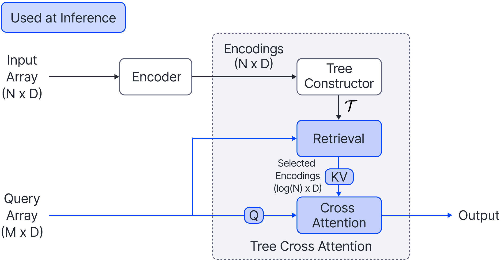

# Tree Cross Attention (TCA)

This is the official implementation of the paper [Tree Cross Attention](https://arxiv.org/abs/2309.17388). 

Tree Cross Attention (TCA) is a module based on Cross Attention that only retrieves information from a logarithmic O(log(N)) number of tokens for performing inference. 
TCA organizes the data in a tree structure and performs a tree search at inference time to retrieve the relevant tokens for prediction. 
Leveraging TCA, we introduce ReTreever, a flexible architecture for token-efficient inference. 




## Install

Create and activate a conda environment. Install the dependencies as listed in `requirements.txt`:

```
conda create --name tca python=3.9
conda activate tca
pip install -r requirements.txt
```

## Usage

The default hyperparameters are saved in `configs/`. Model weights and logs are saved in `results/{setting}/{expid}`. Note that when running experiments, the `{expid}` must match between training and evaluation since the model will load weights from `results/{setting}/{expid}` when evaluating. If training for the first time, evaluation data will be generated and saved in `evalsets/{setting}}`.

To evaluate `Transformer + Cross Attention`, add `--decoder_type ca` to the script. 

### Copy Task

**Training:**

```
python copy_task.py --mode train --expid tca --sequence_length 256
```

**Evaluation:**

```
python copy_task.py --mode eval --expid tca --sequence_length 256
```

### 1D Regression

**Training:**

```
python gp.py --mode train --expid tca
```

**Evaluation:**

```
python gp.py --mode eval --expid tca --eval_kernel rbf 
python gp.py --mode eval --expid tca --eval_kernel matern 
```

### Image Completion (CelebA)

Download the files from the official CelebA [google drive](https://drive.google.com/drive/folders/0B7EVK8r0v71pWEZsZE9oNnFzTm8). Specifically, download [list_eval_partitions.txt](https://drive.google.com/file/d/0B7EVK8r0v71pY0NSMzRuSXJEVkk), [identity_CelebA.txt](https://drive.google.com/file/d/1_ee_0u7vcNLOfNLegJRHmolfH5ICW-XS), and  [img_align_celeba.zip](https://drive.google.com/file/d/0B7EVK8r0v71pZjFTYXZWM3FlRnM) and unzip, placing the downloaded files in `datasets/celeba` folder. 

Alternatively, follow the instructions from the official [website](https://mmlab.ie.cuhk.edu.hk/projects/CelebA.html) to download the aforementioned necessary files. 

After downloading the data, preprocess it by running `python data/celeba.py`.

**Training:**

```
python celeba.py --mode train --expid tca
```

**Evaluation:**

```
python celeba.py --mode eval --expid tca
```

## Image Completion (EMNIST)

**Training:**

If training for the first time, EMNIST training data will automatically download and save in `datasets/emnist`. 

```
python emnist.py --mode train --expid tca
```

**Evaluation:**

```
python emnist.py --mode eval --expid tca --class_range 0 10

python emnist.py --mode eval --expid tca --class_range 10 47
```


## Reference

For technical details, please check the conference version of our paper.
```
@inproceedings{
    feng2024tree,
    title={Tree Cross Attention},
    author={Leo Feng and Frederick Tung and Hossein Hajimirsadeghi and Yoshua Bengio and Mohamed Osama Ahmed},
    booktitle={International Conference on Learning Representations},
    year={2024},
    url={https://openreview.net/forum?id=Vw24wtSddM}
}
```

## Acknowledgement

This code uses parts from the codebases of [Transformer Neural Processes](https://github.com/tung-nd/TNP-pytorch), [Perceiver](https://github.com/lucidrains/Perceiver-pytorch), and [Pytorch](https://github.com/pytorch/tutorials/).


